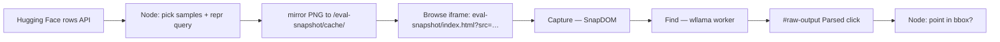

# Mind2Web offline grounding eval

Optional benchmark that scores **ShowUI (or any cached registry model)** on [Multimodal-Mind2Web](https://huggingface.co/datasets/osunlp/Multimodal-Mind2Web) grounding samples. It drives the **real app UI** — same path as gate E2E — not a Python agent or a PNG-injection hook.

This is **not** CI. Gate regression stays `npm run test` (ShowUI-2B ×3 on ShopDemo). Mind2Web is for offline dataset comparison and tuning.

## What it measures

For each dataset row (CLICK, TYPE, or SELECT):

1. Show the dataset screenshot in the in-app browse iframe.
2. **Capture page** — SnapDOM on `#capture-target` (production capture pipeline).
3. **CLICK** — fill Goal with field label **before** Capture, then `btn-find` (gate `runE2EProductionJourney`).
4. **TYPE** — fill Goal with the action phrase **before** Capture (e.g. `type 08817 in US City, State or Zip Code`); after Capture, the harness injects a structured `input` tool call via `__e2eVoiceTool` → ShowUI grounds the **field label** (`target`), not the full phrase.
5. **SELECT** — same: full phrase in Goal; ShowUI grounds **field label** only.
6. Read normalized `[x, y]` from `#click-marker` (voice path uses marker pixels; Find uses marker too).
7. Score **hit** if the point falls inside the dataset `bounding_box_rect` (Node-side only).

TYPE/SELECT inject structured voice tool calls via `?e2e=1` `__e2eVoiceTool` (no mic, no phrase parsing) — same as gate voice E2E. Frozen snapshots cannot apply live DOM type/select; scoring is still **field bbox grounding** only. `operation.value` rides in the tool call, not a separate oracle.

## Blackbox rules

| Allowed | Forbidden |
|---------|-----------|
| Playwright driving Load, address bar, Capture, Find | `import` from `src/` in the eval script |
| Helpers from `tests/e2e/e2e.js` (`openE2eSession`, `runCaptureUntilReady`, `waitForParsedClick`, …) | `?eval=mind2web` hooks or worker PNG injection |
| Node: fetch HF rows, parse repr/attributes, bbox scoring | Live DOM `getBoundingClientRect` for expected coords |
| Mirror dataset PNGs under `public/eval-snapshot/cache/` | Mock/fake wllama clients |

Coords for scoring come **only** from ShowUI on the **SnapDOM screenshot**. Dataset bboxes are labels from Mind2Web — standard grounding eval, not DOM cheating.

## End-to-end flow



**Why mirror PNGs?** Mind2Web offline eval uses **frozen dataset screenshots**, not live websites. The mirror is the same idea as `npm run cache:model` — download once, serve same-origin so the browse iframe can load the image. SnapDOM still captures that page; inference never reads the raw HF URL or a cached file directly.

The browse iframe loads `eval-snapshot/index.html?src=/eval-snapshot/cache/{uid}.png&v={uid}` — image at **width 100%**, `#capture-target` shrink-wrapped to the bitmap (no letterboxing). Pasting `/eval-snapshot/cache/*.png` in the address bar is **auto-rewritten** to the host page in the app.

### Manual debug in your own browser (no Playwright)

```bash
npm run cache:showui
npm run eval:mind2web   # once — downloads samples into public/eval-snapshot/cache/
npm run dev
```

Open **http://127.0.0.1:5173/** in Chrome for manual dev (`npm run dev`). Eval Playwright uses **5174** by default. Pick a row from `mind2web-grounding-results.txt` (or cache filename = `action_uid`):

1. Wait for **Load** (ShowUI-2B).
2. Address bar → `/eval-snapshot/index.html?src=/eval-snapshot/cache/<action_uid>.png&v=<action_uid>` → Enter.
3. **Capture page** → run grounding:
   - **CLICK** — put the `groundLabel` / field name from results in Goal (e.g. `Reservations`), then **Find**.
   - **TYPE / SELECT** — put the full `voice="…"` phrase from results in Goal before capture (e.g. `type 08817 in US City, State or Zip Code`), then inject the tool call (`?e2e=1` + `await __e2eVoiceTool({name:'input', arguments:{target:'…', value:'…'}})`). Goal shows the full phrase; ShowUI inference uses the **field label** (`target`) — not value-only, not a rewritten query.

Compare the red marker to the target region on the screenshot.

## Run

```bash
npm run cache:showui          # or cache the model you want to score
npm run eval:mind2web
```

Starts Vite on `http://127.0.0.1:5174` if nothing is listening. Opens Chrome with WebGPU, production session (`?model=` only — no `?e2e=1`), then runs samples.

Results append to **`mind2web-grounding-results.txt`** (gitignored).

### Environment variables

| Variable | Default | Meaning |
|----------|---------|---------|
| `E2E_MODEL` | `ShowUI-2B` | Registry model under test |
| `MIND2WEB_EVAL_LIMIT` | `3145728` | Max samples total (`npm run eval:mind2web:full` → 7864320) |
| `MIND2WEB_EVAL_PER_TYPE` | `ceil(LIMIT / ops)` | Cap per CLICK / TYPE / SELECT |
| `MIND2WEB_EVAL_OPS` | `CLICK,TYPE,SELECT` | Comma-separated ops to include |
| `MIND2WEB_EVAL_SPLIT` | `test_task` | HF dataset split |
| `MIND2WEB_EVAL_BASE` | `http://127.0.0.1:5174` | App origin (5174 avoids HMR clashes with `npm run dev` on 5173) |
| `MIND2WEB_EVAL_PORT` | `5174` | Port when spawning Vite for eval |
| `MIND2WEB_EVAL_HEADED` | off | `1` = visible Chrome window (debug) |
| `MIND2WEB_EVAL_SLOW_MO` | `0` | Playwright slow-mo ms between actions (with `HEADED=1`) |
| `MIND2WEB_EVAL_BBOX` | on | `0` = hide red Mind2Web bbox overlay on `#screenshot-img` |
| `MIND2WEB_EVAL_FAIL_EARLY_PCT` | `0` | Stop when **harness** FAIL (capture/browse/prewarm/snapshot) reaches this % of scheduled samples; `MISS`/`NEAR` and Find parse failures do **not** count; `0` = run all |
| `MIND2WEB_EVAL_PASS_HIT_PCT` | `85` | Exit 0 when **strict** `bbox_acc` (inside bbox only) ≥ this; NEAR ≤25px does **not** pass |
| `MIND2WEB_EVAL_MAX_SRC_H` | `0` | Skip dataset PNGs taller than this (px). Opt-in scope filter only (e.g. `3200`). |
| `MIND2WEB_EVAL_MAX_BBOX_BOTTOM_FRAC` | `0` | Skip rows whose bbox bottom exceeds this fraction of src height. Opt-in only (e.g. `0.72`). |

Mind2Web uses **longer** timeouts than gate E2E (tall dataset screenshots, multi-query Find). Gate `INFERENCE_TIMEOUT_MS` (12s) is unchanged.

| Constant / env | Default | Use |
|----------------|---------|-----|
| `MIND2WEB_EVAL_NAV_TIMEOUT_MS` | 90s | Browse iframe navigation + chrome ready |
| `MIND2WEB_EVAL_CAPTURE_TIMEOUT_MS` | 60s | SnapDOM status + `#screenshot-img` ready |
| `MIND2WEB_EVAL_PREWARM_TIMEOUT_MS` | 45s | `dataset.groundingReady` after capture |
| `MIND2WEB_EVAL_INFERENCE_TIMEOUT_MS` | 25s | Each Find / `waitForParsedClick` (one per sample) |
| `MIND2WEB_EVAL_PAGE_TIMEOUT_MS` | 180s | Playwright `page.setDefaultTimeout` per sample |

Previously `#screenshot-img` waited only **10s** (gate default) while SnapDOM was allowed **60s** — a common false timeout on tall shots.

After **Capture**, the script draws a **red dashed box** (`data-testid="mind2web-eval-bbox"`) on the screenshot panel for the dataset `bounding_box_rect` (scaled to SnapDOM size). The **click marker** is the model point — compare marker center to the red box.

Examples:

```bash
# Watch one sample in a real Chrome window
MIND2WEB_EVAL_HEADED=1 MIND2WEB_EVAL_LIMIT=1 MIND2WEB_EVAL_OPS=CLICK npm run eval:mind2web

# Quick smoke — one CLICK sample
MIND2WEB_EVAL_LIMIT=1 MIND2WEB_EVAL_OPS=CLICK npm run eval:mind2web

# CLICK-only, 50 samples, MAI-UI-2B
E2E_MODEL=MAI-UI-2B MIND2WEB_EVAL_LIMIT=50 MIND2WEB_EVAL_OPS=CLICK npm run eval:mind2web
```

## Query extraction (Node only)

One Goal per row — **repr text** (`[link] Reservations -> CLICK` → `Reservations`), else the **first** visible attribute in fixed key order (`text`, `aria-label`, `placeholder`, …). **One Find.** No multi-query sweep, no longest-label ranking, no bbox-oracle pick, no warm retry. Rows with no repr or attribute text are skipped at fetch (no label to type). Optional scope filters (`MIND2WEB_EVAL_MAX_SRC_H`, `MIND2WEB_EVAL_MAX_BBOX_BOTTOM_FRAC`) are **off by default**. See `.cursor/rules/mind2web-eval.mdc` for forbidden eval tuning.

```bash
# Quick smoke — unfiltered ×1572864 (524288/op; no fail-early)
npm run eval:mind2web:smoke

# Default — unfiltered ×3145728 (1048576/op)
npm run eval:mind2web

# Long run — ×7864320 (2621440/op)
npm run eval:mind2web:full

# Optional documented scope (not default): tall pages + below-fold bboxes
MIND2WEB_EVAL_LIMIT=1572864 MIND2WEB_EVAL_MAX_SRC_H=3200 MIND2WEB_EVAL_MAX_BBOX_BOTTOM_FRAC=0.72 npm run eval:mind2web:smoke
```

**ShowUI-2B honest baseline (unfiltered, strict bbox):** ~50% at ×12–24, ~42–46% at ×48+ — tall-page CLICK and ambiguous short labels are the main misses.

## Scoring

- **Parsed** — Find returned `Parsed click` and a visible `#click-marker`.
- **HIT** — click pixel inside `bounding_box_rect` (`x,y,w,h` in dataset screenshot space, scaled to capture size when SnapDOM output differs from the source PNG). Scoring uses the **click-marker** position (full precision), not the 3–4 decimal `#raw-output` text. Sub-pixel tolerance `0.5px` on fractional scaled bboxes. **Only HIT counts toward pass.**
- **NEAR** — parsed, outside bbox, but within **25px** of the nearest edge (`edge` in results). **Diagnostic only** — does not count as pass. See `.cursor/rules/mind2web-eval.mdc`.
- **MISS** — parsed but outside bbox and beyond NEAR threshold. Does **not** trigger early exit.
- **FAIL** — capture/inference error or no parse. Opt-in early exit (`MIND2WEB_EVAL_FAIL_EARLY_PCT`) counts **harness** FAIL only (capture/browse/prewarm/snapshot), not MISS/NEAR or Find parse timeout.

### Offset metrics (per sample in `mind2web-grounding-results.txt`)

| Field | Meaning |
|-------|---------|
| `click=(px,py)` | Model point on the **captured** bitmap |
| `bbox_center` | Target element center (bbox scaled to capture) |
| `Δ=(dx,dy)` | Click minus center — signed offset (+ = right / below center) |
| `edge` | Distance to nearest bbox edge (**0 = HIT**) |
| `center` | Distance to bbox center |
| `dir` | Miss direction: `above`, `below`, `left`, `right`, combined (e.g. `above-left`) |
| `src=WxH` | Dataset PNG size when it differs from `shot=WxH` (bbox is scaled) |

Summary block reports **bbox_acc** (pass bar), **median/mean edge distance**, p90, counts within 25 / 50 / 100 px, and **near_acc** (HIT+NEAR — diagnostic only, not pass).

Expect modest accuracy on out-of-distribution sites vs ShopDemo; the harness is for comparison across models and prompt tweaks, not a ship gate.

## Related

| Command | Purpose |
|---------|---------|
| `npm run test` | CI gate — ShowUI-2B, built-in fixture, screenshot green-band checks |
| `npm run test:benchmark` | Per-model load/capture/Find timings on fixture |
| `npm run eval:mind2web` | Default ×3145728 Mind2Web blackbox (`E2E_MODEL`, strict bbox) |
| `npm run eval:mind2web:smoke` | Quick ×1572864 smoke (no fail-early) |
| `npm run eval:mind2web:full` | Long ×7864320 run |
Implementation: `tests/mind2web/mind2web-grounding-eval.mjs`. E2E helpers: `tests/e2e/e2e.js`.
